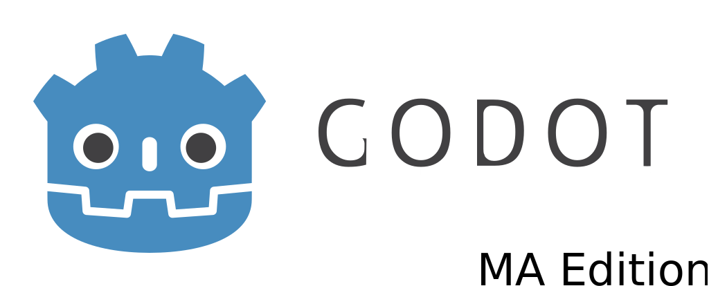

# Godot Engine MA Edition

  

**[Godot Engine](https://godotengine.org) is a feature-packed, cross-platform
game engine to create 2D and 3D games from a unified interface.** It provides a
comprehensive set of common tools, so that users can focus on making games
without having to reinvent the wheel. Games can be exported in one click to a
number of platforms, including the major desktop platforms (Linux, macOS,
Windows), mobile platforms (Android, iOS), as well as Web-based platforms
(HTML5).

Godot Engine MA Edition is a fork of Godot Engine that includes a number of fixes
and enhancements not included in the original Godot Engine. Godot Engine MA Edition
philosophy is:

  * Fix bugs before writing new code
  * Follow C++ Best Practices
  * Reduce technical debt

## Free, open source and community-driven

Godot is completely free and open source under the very permissive MIT license.
No strings attached, no royalties, nothing. The users' games are theirs, down
to the last line of engine code. Godot's development is fully independent and
community-driven, empowering users to help shape their engine to match their
expectations. It is supported by the [Software Freedom Conservancy](https://sfconservancy.org/)
not-for-profit.

## Getting the engine

### Compiling from source

[See the official docs](https://docs.godotengine.org/en/latest/development/compiling/)
for compilation instructions for every supported platform.
